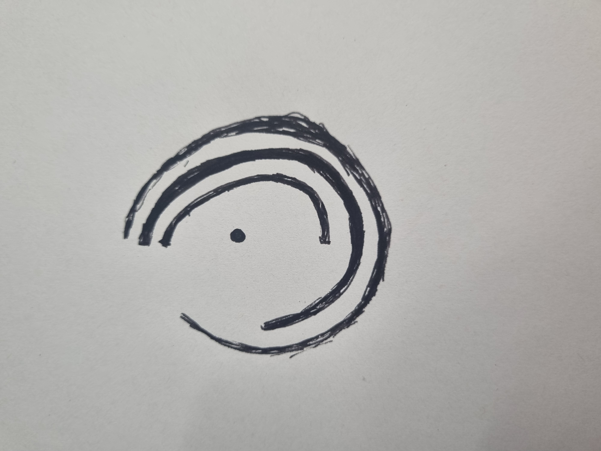
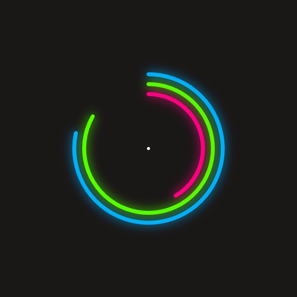

# Week 03: Time & Oscillations
**Date:** 2025-11-29

## Exploration & Experimentation
The brief was to build an "Abstract Clock" that visualizes the passing of time without using numbers or text. I explored the concept of **Cyclical Time**—the idea that time repeats in loops (minutes, hours, days)—rather than a linear timeline.

My goal was to create a "Neon Ring System" where the passage of time is felt through light and motion rather than read through digits.

 

## References
* **Lesson Theme:** "Linear vs. Cyclical Time" - I chose to focus purely on cyclical representation using circles.
* **Technique:** `drawingContext.shadowBlur` in p5.js to create a neon glow effect.

## Algorithmic Thinking
To translate time into geometry, I used the following logic:

* **Mapping Time to Angles:** * I grabbed the current time using `second()`, `minute()`, and `hour()`.
    * I mapped these values (0-60) to degrees (0-360) to determine the length of the arcs.
* **The "Glow" System:** * Standard p5.js functions (`stroke()`) create flat lines. To achieve the glowing look, I accessed the native HTML5 canvas API using `drawingContext.shadowBlur` and `drawingContext.shadowColor`.
* **Visual Hierarchy:**
    * **Outer Ring (Blue):** Seconds (Fastest motion, highly visible).
    * **Middle Ring (Green):** Minutes.
    * **Inner Ring (Pink):** Hours (Slowest).

## Code
Here is the core snippet for drawing the glowing rings:

```javascript
  // Example for the Seconds Ring
  push();
  // ACTIVATING THE GLOW
  drawingContext.shadowBlur = 20; 
  drawingContext.shadowColor = color(200, 100, 100); // Blue Glow
  stroke(200, 100, 100);
  
  // Map seconds (0-60) to angle (0-360)
  let scAngle = map(s, 0, 60, 0, 360);
  
  // Draw the arc
  arc(0, 0, 300, 300, 0, scAngle);
  pop();
  ```

  


<iframe src="./content/day01/90/embed.html" width="600" height="600" frameborder="no"></iframe>
 

  ## Critical Reflection
  
  * **Abstraction of Time:** By removing the numbers, the clock becomes less about "being on time" and more about "feeling" the current moment. The smooth motion of the seconds ring creates a hypnotic rhythm that a ticking second hand lacks.
  * **Cyclical Nature:** The design reinforces the lesson's concept of cyclical time. The arcs grow and then visually "reset" (complete the circle) every minute or hour, emphasizing the loop of time.
  * **Challenges:**  My initial attempt was just a pulsing circle, but it was too abstract—I couldn't tell what time it was. I iterated by adding separate rings for h/m/s, which struck a better balance between "artistic abstraction" and "functional readability."
  * **Future Ideas:** I would like to map the color of the glow to the actual time of day (e.g., warm oranges for noon, cool blues for midnight) to create a "biological clock" feel.