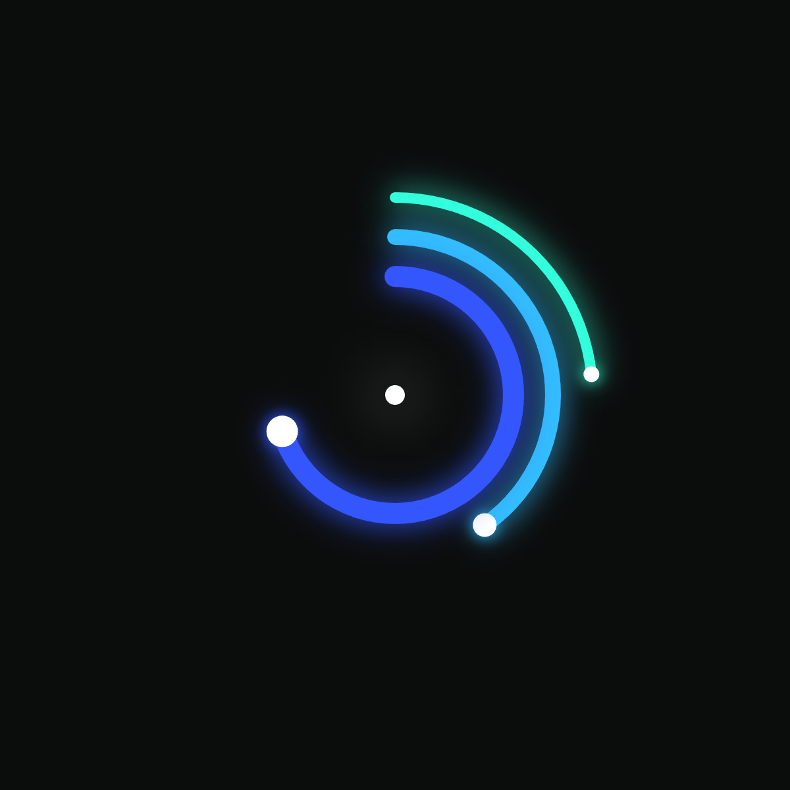

# Week 05: Consolidation & Final Project Plan
**Date:** 2025-11-29

## Retrospective: What Resonated?
We are at the midpoint of the semester. Looking back at the first few modules (Grids, Time, Agents), the module that resonated most with me was **Week 03: Time & Oscillations**.

Specifically, I enjoyed the **Neon Clock** experiment.
* **Why?** I realized that I enjoy "Atmospheric" generative art—visuals that feel like light, energy, or fluids rather than rigid grid structures.
* **Technical Discovery:** Using `drawingContext.shadowBlur` was a breakthrough. It allowed me to break away from the flat, 2D look of standard canvas drawing and create something that feels alive and glowing.

## The Extended Sketch: Atomic Interactive Clock
For this week's coding assignment, I revisited my Neon Clock and extended it into an **Interactive Atomic Clock**.




<iframe 
  src="./content/day01/05/embed.html" 
  style="width: 600px !important; height: 600px !important; border: none; overflow: hidden;" 
  scrolling="no"
></iframe>


**New Features & Refinements:**
1.  **Atomic Visuals:** I added "particles" (electrons) to the tips of the arcs to emphasize the motion and give it a sci-fi interface look.
2.  **Smooth Motion:** My previous clock "ticked" every second. I refined the animation logic by using the native JavaScript `new Date()` object to capture milliseconds. This allows the rings to move in a perfectly continuous fluid motion.
3.  **Interactivity:** The clock is no longer static.
    * `mouseX` controls the **Color Palette** (Hue).
    * `mouseY` controls the **Glow Intensity** (ShadowBlur).

## Code Snippet: The Smoothness Fix
The most important technical update was calculating the precise floating-point time to eliminate stutter:

```javascript
  // We use the native JS Date object to get precise milliseconds
  let now = new Date();
  let ms = now.getMilliseconds();
  let s = now.getSeconds();
  
  // Calculate smooth float value for seamless animation
  let smoothSec = s + (ms / 1000.0);
  let scAngle = map(smoothSec, 0, 60, 0, 360);
```
## Final Project Plan
For my final project, I have decided to build a **Generative Neon Rider**.

* **Core Concept:**
    I want to create a stylized, side-scrolling animation of a neon motorcycle speeding through a digital landscape. The aesthetic will be heavily inspired by "Synthwave" and physical neon tube art.

* **Visual Reference:**
    I am inspired by 2D neon light sculptures where continuous lines form complex shapes (like the body of a sportbike).

* **The "Generative" Aspect:**
    While the bike itself might be a fixed design (constructed using custom vertex shapes), the world around it will be generative:
    1.  **Infinite Road:** A scrolling grid or neon lines that move endlessly to simulate high speed.
    2.  **Audio Reactivity (Stretch Goal):** I want the glow of the bike or the speed of the background to react to music beat.

* **Technical Implementation:**
    * **Drawing:** I will use `beginShape()` and `curveVertex()` to mimic the bent glass tubing of real neon signs.
    * **Lighting:** I will use `drawingContext.shadowBlur` to create the bloom effect.
    * **Motion:** I will implement a "Parallax Scrolling" system where background layers move at different speeds.
