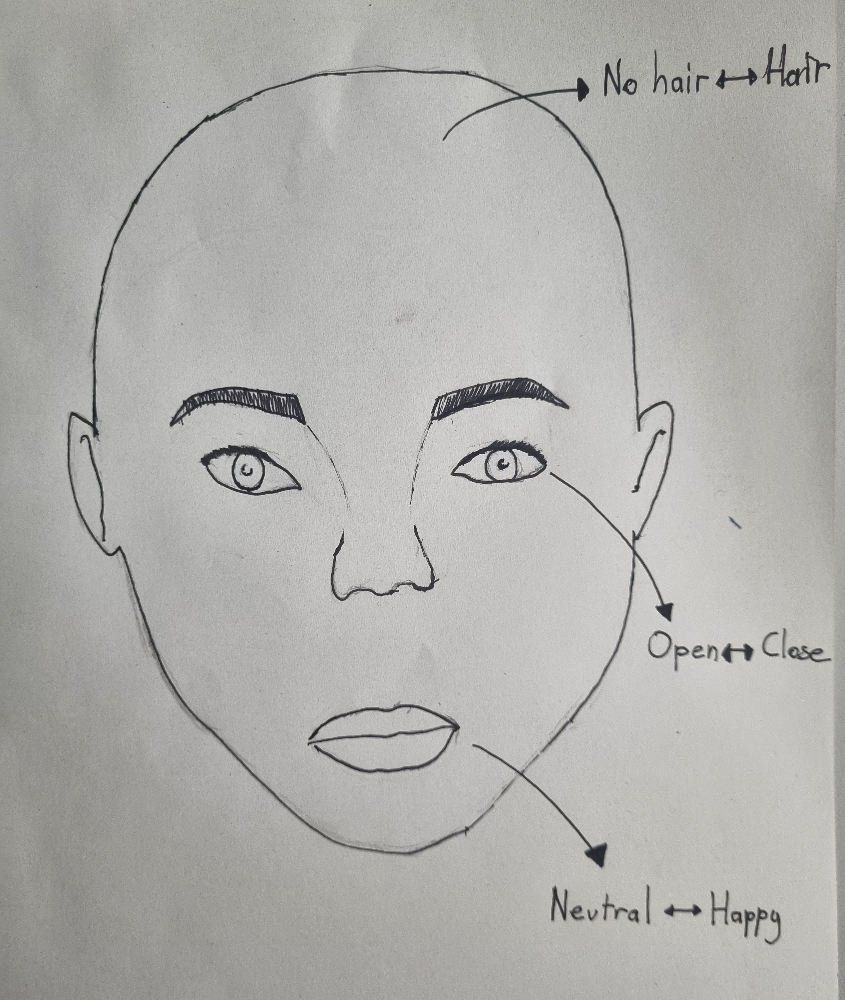
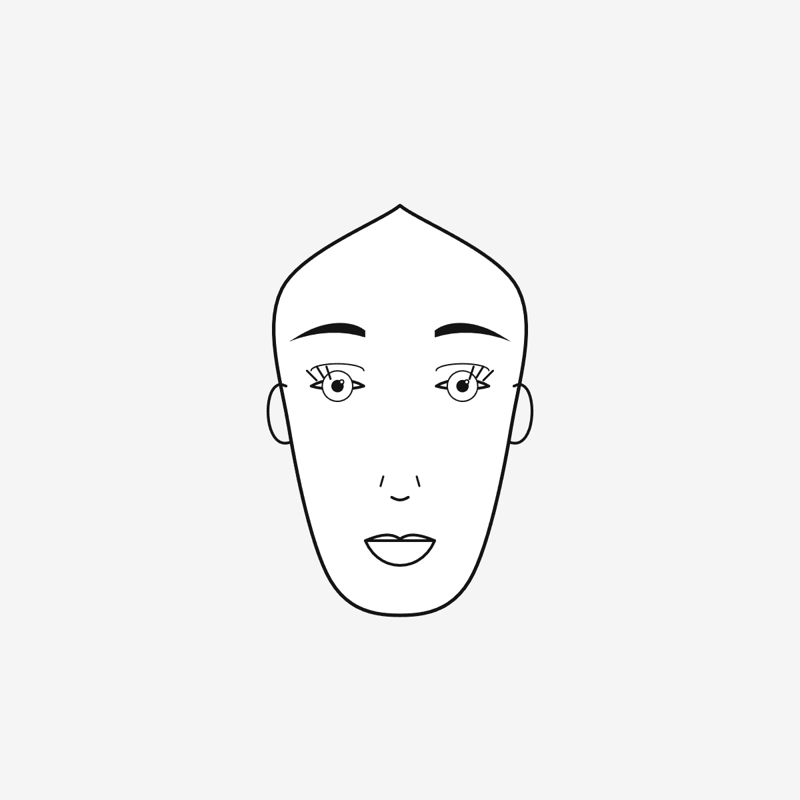

# Week 06: Parametric Faces
**Date:** 2025-11-29

## Exploration & Experimentation
The brief was to create a **Parametric Face Generator**,a system that uses variables to generate unique variations of a face rather than drawing a single static portrait.

I wanted to recreate the specific style of a hand-drawn sketch I made of a woman. My goal was to see if I could make the computer draw something that looked "inked" and organic, while still being changeable.



**My Parameters:**
Based on my sketch, I identified three key variables to control:
1.  **Hair vs. No Hair:** A discrete choice (Toggle).
2.  **Eye Openness:** A continuous variable (Sleepy/Closed $\leftrightarrow$ Wide Awake).
3.  **Mood:** A continuous variable controlling the mouth curve (Neutral $\leftrightarrow$ Happy).

## Algorithmic Thinking
Translating a freehand sketch into code required moving beyond simple circles (`ellipse`). I had to use custom vertex shapes to capture the character.

* **Geometry:** I used `beginShape()` and `curveVertex()` to trace the specific jawline and hair flow from my drawing.
* **The "Human" Touch:** To keep the "sketchy" look, I used `strokeCap(ROUND)` and simple lines for details like the nose bridge and eyelashes.
* **Logic:**
    * *Discrete Parameter:* `if (hasHair) { drawHair(); }`
    * *Continuous Parameter:* The upper eyelid's Y-position is calculated as `y - eyeOpenness`. This allows the eye to smoothly transition from a slit to an almond shape.

## Code
Here is the core function that generates the parametric eyes with lashes:

```javascript
function drawEye(x, y, w, open, isLeft) {
  beginShape();
    vertex(-w/2, 0); // Outer corner
    // Top Lid (Controlled by 'open' parameter)
    bezierVertex(-w/4, -open, w/4, -open, w/2, 0);
    // Bottom Lid (Flatter)
    bezierVertex(w/4, open/2, -w/4, open/2, -w/2, 0);
  endShape();
  
  // Eyelashes (Only drawn on outer edge)
  if (isLeft) {
    line(-15, -open+2, -22, -open-5);
    line(-10, -open, -15, -open-8);
  }
}
```



<iframe src="./content/day01/06/embed.html" width="600" height="600" frameborder="no"></iframe>
 

## Critical Reflection
* **Personality:** The parameter that most affected "personality" was the Eye Openness. When the eyes are narrow (low value), the face looks suspicious or tired. When wide open (high value), she looks alert. Combined with the mouth curve, I can generate a wide range of emotions (e.g., Happy/Tired, Neutral/Alert).

* **Abstraction vs. Recognition:** Even though the face is made of simple lines without shading, it is immediately recognizable as a specific female character. The key details were the jaw shape and the eyelashes. This proves that we recognize faces based on the relationship between features (proportions) rather than photorealistic detail.

* **Discrete vs. Continuous:** The "Hair" parameter (Discrete) creates the most dramatic visual change, making it look like a completely different person, whereas the "Mood" (Continuous) just changes the expression of the same person.
