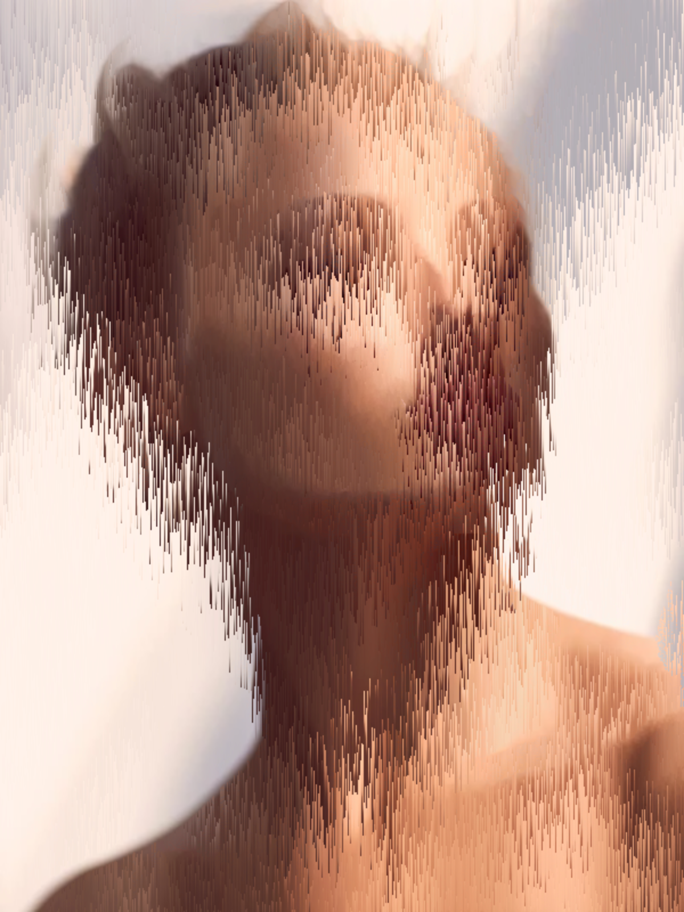

# Week 07: Pixels as Material
**Date:** 2025-11-30

## Exploration & Experimentation
This week shifted the focus from drawing shapes (circles, rects) to manipulating raw data. The goal was to treat the pixels of an image not as a fixed picture, but as a collection of sortable data points.

I chose to explore **Pixel Sorting**, a glitch art technique where pixels are rearranged based on their color values.

**The Process:**
I started with a high-contrast portrait because the clear distinction between light and dark areas creates more dramatic sorting effects.

| Original Source | Transformed Output |
| :---: | :---: |
|  |  |

## Algorithmic Thinking
Instead of telling the computer "draw a line," I told it to:
1.  **Load** the pixel data of the image.
2.  **Iterate** through every vertical column of the image.
3.  **Select** random chunks (strips) of pixels within those columns.
4.  **Sort** the pixels in that chunk based on their **Brightness** value.
5.  **Place** them back onto the canvas.

This creates a "melting" effect because the brightest pixels float to the top of their chunk, and the darkest sink to the bottom (or vice versa depending on the sort order).

## Code
Here is the core logic for the "Pixel Melter":

```javascript
// Function to sort a piece of a column by brightness
function sortColumn(x, y, h) {
  let strip = [];
  
  // 1. Extract pixels
  for (let i = y; i < min(y + h, img.height); i++) {
    let index = (x + i * img.width) * 4;
    let r = img.pixels[index];
    let g = img.pixels[index + 1];
    let b = img.pixels[index + 2];
    
    // Calculate brightness
    let bright = (r + g + b) / 3;
    strip.push({ c: [r, g, b, 255], b: bright });
  }
  
  // 2. Sort the strip based on brightness
  strip.sort((a, b) => b.b - a.b);
  
  // 3. Put pixels back
  // ... (Code to write back to img.pixels)
}
```
## Critical Thinking

* **Pixels as Material:** Treating pixels as material changed my perception of the image. It stopped being a "face" and became a "dataset." I realized that an image is just a grid of numbers that can be reshuffled like a deck of cards.

* **Aesthetics:** An unexpected aesthetic that emerged was the "painterly" quality. The sorting destroyed the sharp details (like skin texture) but preserved the broader strokes of light and shadow, making it look almost like a dripping oil painting.

* **Unrecognizability:** The original image starts to become unrecognizable where the "drips" are longest. However, because I kept the vertical column structure intact, the human brain can still reconstruct the face from the remaining cues. This creates a tension between the abstract data and the recognizable subject.