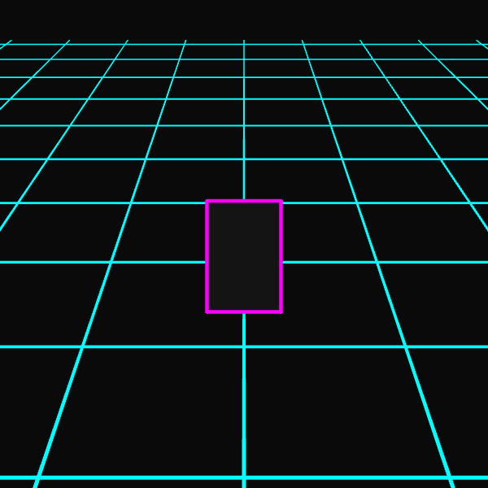

# Week 09: Advanced Composition & Final Prototype

## Exploration: The Infinite Road
For this week's focus on **Advanced Composition and Spatial Design**, I began prototyping the environment for my final project (The Neon Tron Bike).

Instead of sticking to 2D shapes, I explored **WEBGL (3D mode)** to create an infinite, scrolling grid. This will serve as the "road" that my neon bike travels on.




<iframe src="./content/day01/09/embed.html" width="600" height="600" frameborder="no"></iframe>
 

## Algorithmic Thinking (3D)
Moving from 2D to 3D required a shift in logic:
* **The Camera:** In 2D, (0,0) is the top-left. In 3D WEBGL, (0,0,0) is the center of the world. I had to use `translate()` and `rotateX()` to position the "camera" above the grid looking down.
* **The Loop:** To create the illusion of infinite speed, I am not actually moving the lines forever. I am moving them by a small amount (`offset`) and then snapping them back every 100 pixels. This is a classic game development trick to save memory.

## Code Snippet
Here is the logic for the "Infinite Scroll" effect in 3D:

```javascript
  // Move the grid based on time
  let speed = 0.2;
  // The modulo (%) operator resets the position every 100px
  let offset = (millis() * speed) % 100; 

  // Draw Horizontal Lines moving towards camera
  for (let z = -600; z <= 600; z += 100) {
    // Add offset to Z to create motion
    let movingZ = z + offset;
    line(-600, movingZ, 0, 600, movingZ, 0);
  }
```
## Critical Reflection

* **How 3D changes design thinking:** Working in spatial media forces you to think about "Depth" and "Camera Angle." In 2D, if I want to show speed, I just move an object left-to-right. In 3D, I have to consider the Z-axis and how perspective makes distant objects look smaller automatically. It feels more like "directing a scene" than "drawing a picture."

* **Tools for Final Project:** I am committing to using p5.js in WEBGL mode for the environment because the perspective grid is essential for the Synthwave aesthetic. However, I might render the bike itself using 2D shapes (beginShape) overlaid on top to maintain that specific "neon tube" look I identified in my plan.
