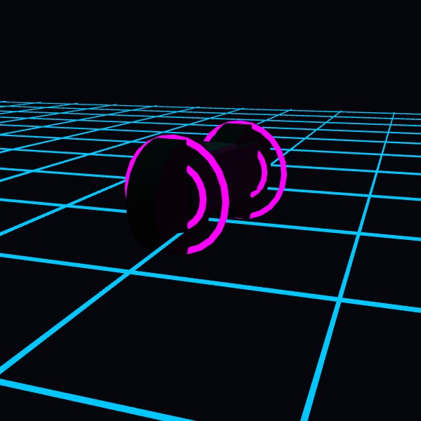

# Week 10: Integration & Experimentation
**Date:** 2025-12-04

## Integration: The Digital Object
This week's goal was to integrate multiple techniques into a cohesive whole. For my final project prototype, I focused on integrating **3D Modeling** with **Generative Materials**.

I decided to pause on the interaction code to ensure the visual design of the "Tron Bike" was solid. I built a compound shape using primitives (Boxes + Cylinders + Tori) to create the iconic Light Cycle.


<iframe src="./content/day01/10/embed.html" width="600" height="600" frameborder="no"></iframe>
 

## Technical Integration
The most successful integration was combining **P5.js Geometry** with **Lighting/Materials**.
* **Geometry:** I used `box()` for the chassis and `cylinder()`/`torus()` for the wheels.
* **Materials:** To achieve the "Tron" look, standard colors weren't enough. I used:
    * `specularMaterial(255)` with `shininess(50)` for the body to make it look like polished metal/plastic.
    * `emissiveMaterial(255, 0, 255)` for the wheels to make them ignore shadows and appear to glow from within.

## Challenges & Refining
* **Refining:** The integration of the bike onto the grid works visually, but the connection feels a bit "floaty." Before the final, I need to ensure the wheels align perfectly with the grid lines to ground the object.
* **Next Steps:** Now that the design is defined, I will re-introduce the `keyIsDown` interaction controls and the light trail array in the final phase.